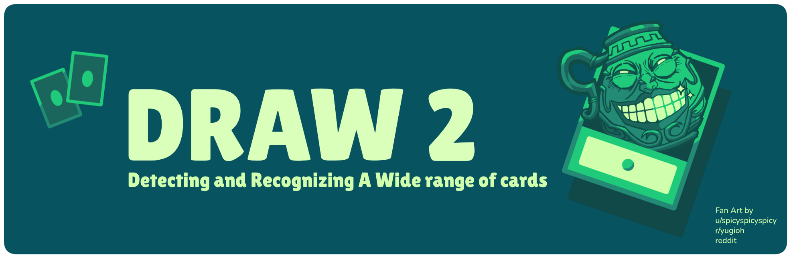

<div align="center">
    <p>
        
    </p>


<div>

[](LICENSE)
[](https://github.com/HichTala/draw2)
[](https://twitter.com/tiazden)
[](https://huggingface.co/HichTala/draw2)
[](https://github.com/HichTala/draw2-obsplugin)
[](https://wandb.ai/hich_/draw)
[](https://medium.com/@hich.tala.phd/how-i-trained-again-my-model-to-detect-and-recognise-a-wide-range-of-yu-gi-oh-cards-5c567a320b0a)

[🇫🇷 Français](README_fr.md)


</div>

</div>

DRAW 2 (which stands for **D**etect and **R**ecognize **A** **W**ide range of cards version 2) is an object detector
trained to detect _Yu-Gi-Oh!_ cards in all types of images, and in particular in dueling images.

With this new version, **DRAW 2** goes beyond its predecessor. It’s more accurate, more robust, and way easier to use.
It now includes an [OBS plugin](https://github.com/HichTala/draw2-obsplugin) that lets users seamlessly integrate the
detector directly into their live streams or recorded videos; and those **without any particular technical skills**.
The plugin can display detected cards in real time for an enhanced viewing experience.

Other works exist (see [Related Works](#div-aligncenterrelated-worksdiv)) but none is capable of recognizing cards
during a duel.

This project is licensed under the [GNU Affero General Public License v3.0](LICENCE); all contributions are welcome.

---

## <div align="center">📄Documentation</div>

If you juste want to use the plugin, please refer to the [OBS plugin page](https://github.com/HichTala/draw2-obsplugin).
You don't need to install anything from this repository.
The documentation below is for people who want to use the detector outside of OBS, this will require some coding skills.

### Installation

You need python to be installed. Python installation isn't going to be detailed here, you can refer to
the [documentation](https://www.python.org/).

We first need to install pytorch. It is recommended to use a package manager such
as [miniconda](https://docs.conda.io/projects/miniconda/en/latest/).
Please refer to the [documentation](https://docs.conda.io/projects/miniconda/en/latest/).

When everything is set up you can run the following command to install pytorch:

```shell
python -m pip install torch torchvision
```

If you want to use you gpus to make everything run faster, please refer
the [documentation](https://pytorch.org/get-started/locally/)

Then you just have to clone the repo and install `requirements`:

```shell
git clone https://github.com/HichTala/draw
cd draw
python -m pip install -r requirements.txt
```

If you don't want to clone the repository and have already all the requirements installed, you can just run:

```shell
python -m pip install git+https://github.com/HichTala/draw2.git
```

Your installation is now completed.

### 🚀 Usage

Once the installation is done, you can use the detector by executing the following command:

```shell
python -m draw
```

You can use the `--help` flag to see all available options:

```shell
python -m draw --help
```

Here are the most important options:

- `--source`: Path to your image, video, or webcam index (default is `0` for webcam).
- `--save`: Save path for the output.
- `--show`: Display the output in a window.
- `--display-card`: Display detected cards on the output.
- `--deck-list`: Path to a ydk file containing the list of cards in your deck for better recognition.
- `--fps`: FPS of the saved video (default is 60).

---

## <div align="center">💡Inspiration</div>

This project is inspired by content creator [SuperZouloux](https://www.youtube.com/watch?v=64-LfbggqKI)'s idea of a
hologram bringing _Yu-Gi-Oh!_ cards to life.
His project uses chips inserted under the sleeves of each card,
which are read by the play mat, enabling the cards to be recognized.

Inserting the chips into the sleeves is not only laborious, but also poses another problem:
face-down cards are read in the same way as face-up ones.
So an automatic detector is a really suitable solution.

Although this project was discouraged by _KONAMI_ <sup>®</sup>, the game's publisher (which is quite understandable),
we can nevertheless imagine such a system being used to display the cards played during a live duel,
to allow viewers to read the cards.

---

## <div align="center">🔗Related Works</div>

Although to my knowledge `draw` is the first detector capable of locating and detecting _Yu-Gi-Oh!_ cards in a dueling
environment,
other works exist and were a source of inspiration for this project. It's worth mentioning them here.

[Yu-Gi-Oh! NEURON](https://www.konami.com/games/eu/fr/products/yugioh_neuron/) is an official application developed by
_KONAMI_ <sup>®</sup>.
It's packed with features, including cards recognition. The application is capable of recognizing a total of 20 cards at
a time, which is very decent.
The drawback is that the cards must be of good quality to be recognized, which is not necessarily the case in a duel
context.
What's more, it can't be integrated, so the only way to use it is to use the application.

[yugioh one shot learning](https://github.com/vanstorm9/yugioh-one-shot-learning) made by `vanstorm9` is a
Yu-Gi-Oh! cards classification program that allow you to recognize cards. It uses siamese network to train its
classification
model. It gives very impressive results on images with a good quality but not that good on low quality images, and it
can't localize cards.

[Yolov11](https://github.com/ultralytics/ultralytics) is the last version of the very famous `yolo` family of object
detector models that handle oriented bounding boxes.
I think it doesn't need to be presented today, it represents state-of-the-art real time object detection model.

[ViT](https://arxiv.org/pdf/2010.11929.pdf) is a pre-trained model for image classification based on the Vision
Transformer architecture.
It relies entirely on attention mechanisms to process image patches instead of using convolutional layers.
It fits our task well since pre-trained versions on large-scale datasets such as ImageNet-21K are available.
This is particularly relevant for our use case, as it enables handling a large number of visual categories similar to
the 13k+ unique cards found in _Yu-Gi-Oh!_.

[SpellTable](https://spelltable.wizards.com/) is a free application designed and built by `Jonathan Rowny` and his team
for playing paper _Magic: The Gathering_ from a distance.
It allows player to click on a card on any player's feed to quickly identify it.
It has some similarity with `draw` since it can localize and recognize any card from a built in database of 17 000
cards.
The idea is close to this project, but it didn't originate it.

---
## <div align="center">🔍Method Overview</div>

A medium blog post explainng the main process from data collection to final prediction has been written. 
You can access it at [this](https://medium.com/@hich.tala.phd/how-i-trained-again-my-model-to-detect-and-recognise-a-wide-range-of-yu-gi-oh-cards-5c567a320b0a) adress. If you have any questions, don't hesitate to open an issue.

[](https://medium.com/@hich.tala.phd/how-i-trained-again-my-model-to-detect-and-recognise-a-wide-range-of-yu-gi-oh-cards-5c567a320b0a)

---

## <div align="center">💬Contact</div>

You can reach me on Twitter [@tiazden](https://twitter.com/tiazden) or by email
at [hich.tala.phd@gmail.com](mailto:hich.tala.phd@gmail.com).

---

## <div align="center">⭐Star History</div>

<a href="https://www.star-history.com/#HichTala/draw2&type=date&legend=top-left">
 <picture>
   <source media="(prefers-color-scheme: dark)" srcset="https://api.star-history.com/svg?repos=HichTala/draw2&type=date&theme=dark&legend=top-left" />
   <source media="(prefers-color-scheme: light)" srcset="https://api.star-history.com/svg?repos=HichTala/draw2&type=date&legend=top-left" />
   
 </picture>
</a>
